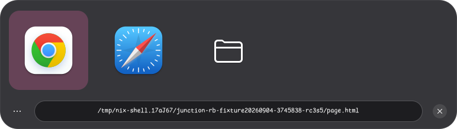

# Junction (Ruby)

A Ruby GTK4 / Libadwaita port of [Junction](https://junction.sonny.re) by Sonny
Piers.

Junction asks which application should open a link or a file. Set it as the
handler for `http` and `https` and every link you click puts up a row of the
browsers and apps that can take it, with the URL editable underneath, instead of
silently going to whichever one you set as default a year ago.



## Running

The dev shell brings Ruby, GTK4, Libadwaita and the introspection typelibs:

```sh
direnv allow            # or: nix develop
bundle install
rake schema             # compile the GSettings schema into data/schemas
GSETTINGS_SCHEMA_DIR=$PWD/data/schemas bundle exec ruby bin/junction-rb https://example.com
```

With no arguments it shows the welcome window, which offers to register itself
as the handler for the web types.

## Using it

Click a tile to open the resource with that application and close Junction.

| | |
|---|---|
| Click | open, and close Junction |
| Ctrl+click, or middle click | open, and leave Junction up for another |
| Right click, long press, or the Menu key | that application's desktop actions |
| `1`…`9` | open with the application at that position |
| ←, → | move between applications |
| Return, space | open with the selected application |
| Ctrl+Return, Ctrl+space | open with it and stay |
| Ctrl+C | copy the location |
| Escape, Ctrl+W | close |
| Ctrl+? | keyboard shortcuts |
| Ctrl+Q | quit |

The URL is editable before you hand it on, so a tracking parameter can be
trimmed on the way past. File paths are shown but not editable.

The main menu carries a light/system/dark switcher, "Show App Names" for labels
under the icons, and "Copy to Clipboard".

## Development

```sh
rake            # schema, then the tests, then rubocop
rake test       # the suite; UI tests run headlessly and write tmp/shots/*.png
rake lint
```

`JUNCTION_RB_DEV=1` adds the restart accelerator (Ctrl+Shift+Q) and the `devel`
window styling.

The tests drive the real app with no display server. GTK4 renders offscreen, so
the screenshots under `tmp/shots` are worth looking at — they show what the
assertions do not think to ask about.

`PORTING.md` records what changed on the way over from GJS.

## Licence

GPL-3.0-only, as the original.
